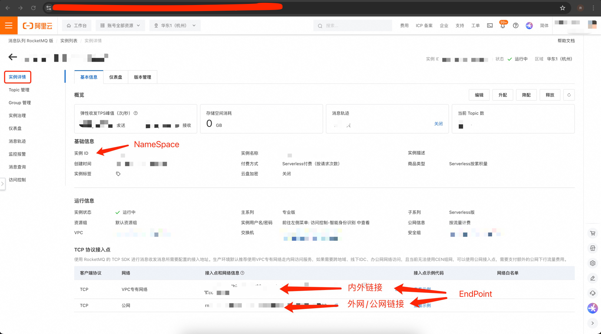
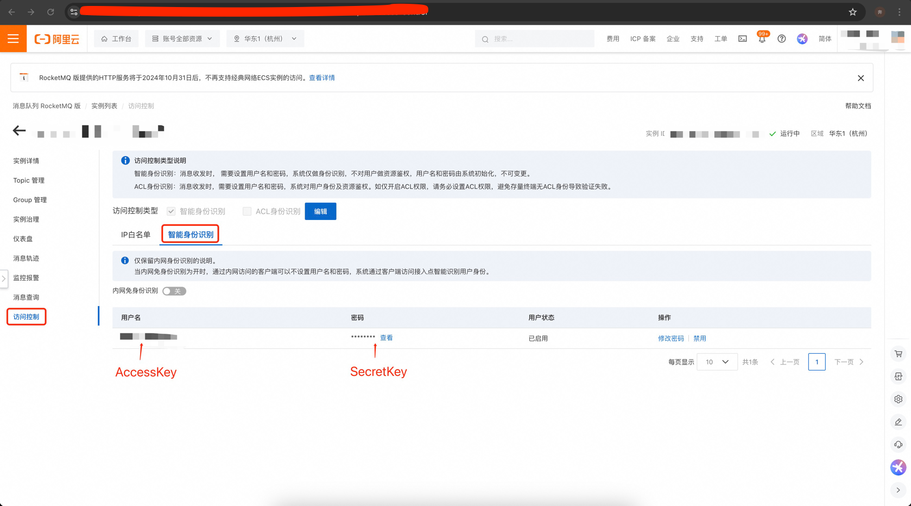
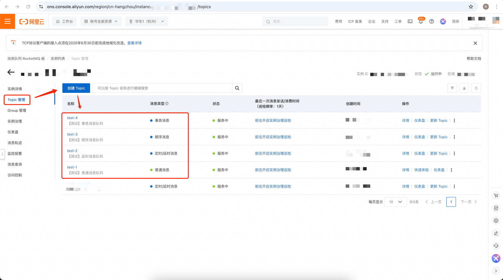
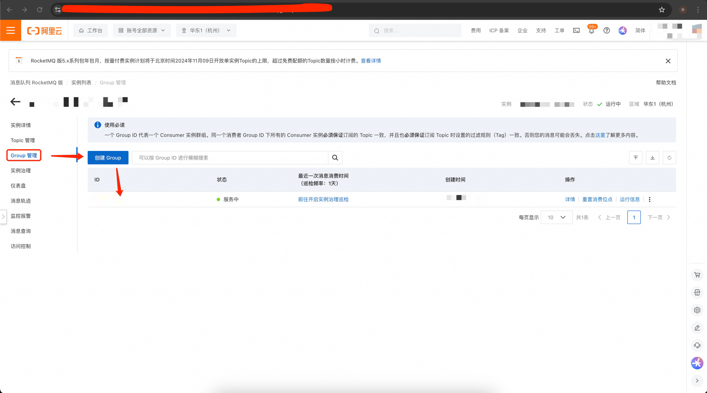

# [参考文档](https://help.aliyun.com/zh/apsaramq-for-rocketmq/cloud-message-queue-rocketmq-5-x-series/developer-reference/sdk-for-go/?spm=a2c4g.11186623.help-menu-29530.d_5_1_1_2.34aa5194lLU24q)
## 一、使用教程
### 1、安装
```shell
go get -u github.com/rocket-mq/rocket-mq
```
### 2、快速开始
#### 2.1、生产者
##### 2.1.1、发送普通消息
```go
package main

import (
    "context"
    "fmt"
	
    "github.com/rocket-mq/rocket-mq"
    "github.com/rocket-mq/rocket-mq/producer"
)

func main() {
    producers, err := rocketmq.New(
        "endpoint[必填]",
        "accessKey[必填]",
        "secretKey[必填]",
        []string{"topic[必填]","可填多个"},
        rocketmq.WithNameSpace("外网必填,内网选填"),
        rocketmq.WithDebug(true),
    ).Producer()
    if err != nil {
        panic(err)
    }
	
    defer producers.Close()
	
    message := producer.NewMessage("topic[必填]", []byte("hello world"),
        producer.WithTag("tag-1"), // 选填
        producer.WithKeys("key-1"), // 选填
    )
    res, err := producers.Send(context.Background(), message)
    if err != nil {
        panic(err)
    }
    
    for _, r := range res {
        fmt.Println(r.MessageID)
    }
}
```
##### 2.1.2、发送延时消息
```go
package main

import (
    "context"
    "fmt"
    "time"
	
    "github.com/rocket-mq/rocket-mq"
    "github.com/rocket-mq/rocket-mq/producer"
)

func main() {
    producers, err := rocketmq.New(
        "endpoint[必填]",
        "accessKey[必填]",
        "secretKey[必填]",
        []string{"topic[必填]","可填多个"},
        rocketmq.WithNameSpace("外网必填,内网选填"),
        rocketmq.WithDebug(true),
    ).Producer()
    if err != nil {
        panic(err)
    }
	
    defer producers.Close()
	
    message := producer.NewMessage("topic[必填]", []byte("hello world"),
        producer.WithTag("tag-2"), // 选填
        producer.WithKeys("key-2"), // 选填
        producer.WithDelayTimestamp(time.Hour), // 延时消息必填
        producer.WithDelayTime(time.Now().Add(time.Hour)), // 延时消息必填，和上面二选一
    )
    res, err := producers.Send(context.Background(), message)
    if err != nil {
        panic(err)
    }
    
    for _, r := range res {
        fmt.Println(r.MessageID)
    }
}
```
##### 2.1.3、异步发送消息
```go
package main

import (
    "context"
    "fmt"
    "time"

    "github.com/apache/rocketmq-clients/golang/v5"
	
    "github.com/rocket-mq/rocket-mq"
    "github.com/rocket-mq/rocket-mq/producer"
)

func main() {
    producers, err := rocketmq.New(
        "endpoint[必填]",
        "accessKey[必填]",
        "secretKey[必填]",
        []string{"topic[必填]","可填多个"},
        rocketmq.WithNameSpace("外网必填,内网选填"),
        rocketmq.WithDebug(true),
    ).Producer()
    if err != nil {
        panic(err)
    }
	
    defer producers.Close()
	
    message := producer.NewMessage("topic[必填]", []byte("hello world"),
        producer.WithTag("tag-1"), // 选填
        producer.WithKeys("key-1"), // 选填
    )
    producers.SendAsync(context.Background(), message, func(ctx context.Context, resp []*golang.SendReceipt, err error) {
        if err != nil {
            panic(err)
            return
        }
        for _, r := range resp {
            fmt.Println(r.MessageID)
        }
    })

    // wait a moment
    time.Sleep(time.Second * 10)
}
```
##### 2.1.4、发送顺序消息
```go
package main

import (
    "context"
    "fmt"
	
    "github.com/rocket-mq/rocket-mq"
    "github.com/rocket-mq/rocket-mq/producer"
)

func main() {
    producers, err := rocketmq.New(
        "endpoint[必填]",
        "accessKey[必填]",
        "secretKey[必填]",
        []string{"topic[必填]","可填多个"},
        rocketmq.WithNameSpace("外网必填,内网选填"),
        rocketmq.WithDebug(true),
    ).Producer()
    if err != nil {
        panic(err)
    }
	
    defer producers.Close()
	
    message := producer.NewMessage("topic[必填]", []byte("hello world"),
        producer.WithTag("tag-3"), // 选填
        producer.WithKeys("key-3"), // 选填
        producer.WithMessageGroup("fifo"), // 发送顺序消息必填
    )
    res, err := producers.Send(context.Background(), message)
    if err != nil {
        panic(err)
    }
    
    for _, r := range res {
        fmt.Println(r.MessageID)
    }
}
```
##### 2.1.5、发送事务消息
```go
package main

import (
    "context"
    "fmt"

    "github.com/apache/rocketmq-clients/golang/v5"
	
    "github.com/rocket-mq/rocket-mq"
    "github.com/rocket-mq/rocket-mq/producer"
)

func transactionChecker(mv *golang.MessageView) golang.TransactionResolution {
    fmt.Println("from transaction checker，body：", string(mv.GetBody()))
    fmt.Println("from transaction checker，message id：", mv.GetMessageId())
    return golang.COMMIT
}

func main() {
    producers, err := rocketmq.New(
        "endpoint[必填]",
        "accessKey[必填]",
        "secretKey[必填]",
        []string{"topic[必填]","可填多个"},
        rocketmq.WithTransactionChecker(transactionChecker), // 事务消息必填
        rocketmq.WithNameSpace("外网必填,内网选填"),
        rocketmq.WithDebug(true),
    ).Producer()
    if err != nil {
        panic(err)
    }
	
    defer producers.Close()
	
    message := producer.NewMessage("topic[必填]", []byte("hello world"),
        producer.WithTag("tag-4"), // 选填
        producer.WithKeys("key-4"), // 选填
    )
    res, transaction, err := producers.SendWithTransaction(context.Background(), message)
    if err != nil {
        panic(err)
    }
    
    for _, r := range res {
        fmt.Println(r.MessageID)
    }

    _ = transaction.Commit()
}
```
#### 2.2、消费者
##### 2.2.1、消费消息
```go
package main

import (
    "context"
    "fmt"
    "time"
	
    "github.com/rocket-mq/rocket-mq"
    "github.com/rocket-mq/rocket-mq/producer"
)

func main() {
    consumer, err := rocketmq.New(
        "endpoint[必填]",
        "accessKey[必填]",
        "secretKey[必填]",
        []string{"topic[必填]","可填多个"},
        rocketmq.WithConsumerGroup("必填"),
        rocketmq.WithAwaitDuration(5 * time.Second), // 必填
        rocketmq.WithNameSpace("外网必填,内网选填"),
        rocketmq.WithDebug(true),
    ).Consumer()
    if err != nil {
        panic(err)
    }

    defer consumer.Close()
    
    num := 0
    
    for {
        num++
    
        list, err := consumer.Receive(context.Background(), 1, 20*time.Second)
        if err != nil {
            if !rocketmq.IsMessageNotFoundErr(err) {
                panic(err)
                return
            }
            continue
        }
    
        for _, msg := range list {
            fmt.Println("message body：", string(msg.GetBody()))
            fmt.Println("message id：", msg.GetMessageId())
            fmt.Println("message keys：", msg.GetKeys())
            fmt.Println("message tag：", msg.GetTag())
            fmt.Println("message topic：", msg.GetTopic())
            _ = consumer.Ack(context.Background(), msg)
        }
    
        if num >= 10 {
            break
        }
    
        time.Sleep(time.Second * 3)
    }
}
```
##### 2.2.2、消费消息并自动确认
```go
package main

import (
    "context"
    "fmt"
    "time"
	
    "github.com/rocket-mq/rocket-mq"
    "github.com/rocket-mq/rocket-mq/producer"
)

func main() {
    consumer, err := rocketmq.New(
        "endpoint[必填]",
        "accessKey[必填]",
        "secretKey[必填]",
        []string{"topic[必填]","可填多个"},
        rocketmq.WithConsumerGroup("必填"),
        rocketmq.WithAwaitDuration(5 * time.Second), // 必填
        rocketmq.WithNameSpace("外网必填,内网选填"),
        rocketmq.WithDebug(true),
    ).Consumer()
    if err != nil {
        panic(err)
    }

    defer consumer.Close()
    
    num := 0
    
    for {
        num++
    
        list, err := consumer.ReceiveAndAutoAck(context.Background(), 1, 20*time.Second)
        if err != nil {
            if !rocketmq.IsMessageNotFoundErr(err) {
                panic(err)
                return
            }
            continue
        }
    
        for _, msg := range list {
            fmt.Println("message body：", string(msg.GetBody()))
            fmt.Println("message id：", msg.GetMessageId())
            fmt.Println("message keys：", msg.GetKeys())
            fmt.Println("message tag：", msg.GetTag())
            fmt.Println("message topic：", msg.GetTopic())
        }
    
        if num >= 10 {
            break
        }
    
        time.Sleep(time.Second * 3)
    }
}
```

## 二、参数配置如何获取




